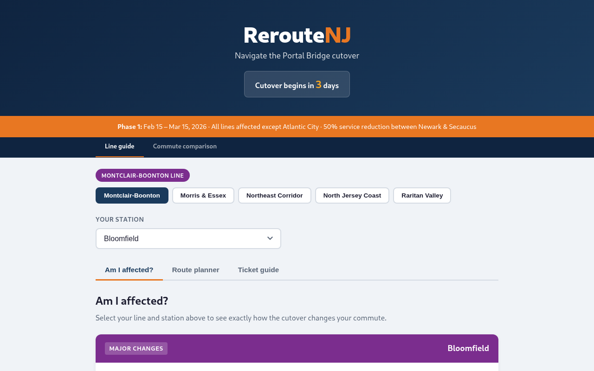

<div align="center">

# Reroute NJ

**Free tools to help NJ Transit riders navigate the Portal North Bridge cutover**

[](https://reroutenj.org)
[](#timeline)
[](#lines-covered)
[](#translations)

[](https://github.com/jamditis/reroute-nj/deployments)
[](LICENSE)
[](#running-locally)

<br>



</div>

---

## What's here

- **[Line guide](https://reroutenj.org/)** — Select your NJ Transit line and station to see how the cutover affects your commute, get route alternatives, and figure out what ticket to buy
- **[Commute comparison](https://reroutenj.org/compare.html)** — Pick your station and Manhattan destination, see every route option side by side with visual time breakdowns
- **[News coverage](https://reroutenj.org/coverage.html)** — Curated feed of Portal Bridge cutover coverage from local and regional news sources, filterable by source, category, line, and direction
- **[Interactive map](https://reroutenj.org/map.html)** — Visualize the Portal Bridge location, affected stations, transfer hubs, and alternative routes
- **[Embed & share](https://reroutenj.org/embed.html)** — Embed widgets, link, or republish any of these tools on your own site

## Lines covered

All NJ Transit rail lines affected by the Portal North Bridge cutover:

| Line | Impact | What changes |
|------|--------|--------------|
| Montclair-Boonton | Diverted to Hoboken | All weekday Midtown Direct trains go to Hoboken instead of Penn Station NY |
| Morris & Essex / Gladstone | Diverted to Hoboken | All weekday Midtown Direct trains go to Hoboken instead of Penn Station NY |
| Northeast Corridor | Reduced service | 50% fewer trains between Newark and Penn Station NY |
| North Jersey Coast | Reduced service | 50% fewer trains between Newark and Penn Station NY |
| Raritan Valley | Newark termination | One-seat rides to Penn Station NY suspended; trains terminate at Newark Penn |

## Architecture

Reroute NJ is a zero-build static site. No npm, no webpack, no framework — just HTML, CSS, and vanilla JavaScript.

```
reroute-nj/
├── index.html              # Line guide tool
├── compare.html            # Commute comparison tool
├── coverage.html           # News coverage feed
├── map.html                # Interactive cutover map
├── embed.html              # Embed & share page
├── blog.html               # Blog / updates
├── js/
│   ├── shared.js           # Shared globals: esc(), countdown, date constants
│   ├── app.js              # Line guide logic (IIFE, ~1000 lines)
│   ├── compare.js          # Comparison tool logic (IIFE, ~700 lines)
│   ├── coverage.js         # Coverage feed logic (IIFE)
│   └── i18n.js             # Translation loader with t() function
├── css/
│   └── styles.css          # All styles, CSS custom properties for theming
├── img/
│   ├── favicon.svg         # SVG favicon
│   ├── og-image.png        # Social preview image
│   └── screenshot.png      # README screenshot
├── data/
│   └── coverage.json       # Curated article data for the coverage feed
├── translations/           # Translation JSON files
│   ├── en.json             # English (base)
│   ├── es.json             # Spanish
│   ├── zh.json             # Chinese (Simplified)
│   └── ...                 # + 8 more languages
├── tools/
│   └── generate-pages.py   # Generates translated HTML pages from templates
└── {lang}/                 # Generated translated pages (es/, zh/, ko/, etc.)
    ├── index.html
    ├── compare.html
    ├── coverage.html
    ├── map.html
    └── embed.html
```

**Why no build step?** This site serves transit riders during a stressful infrastructure change. A simple architecture means anyone can contribute — including journalists and civic tech volunteers who may not have Node.js installed. Open `index.html` in a browser and you're running the full app.

**Data model:** All transit data lives in the `LINE_DATA` object in `js/app.js`. Each line has an `impactType` (`hoboken-diversion`, `reduced-service`, or `newark-termination`) that drives which content templates render. See [AGENTS.md](AGENTS.md) for details.

## Translations

All five tools are available in 11 languages, chosen based on [NJ Transit ridership demographics](https://www.njtransit.com/):

| Language | Code | Direction |
|----------|------|-----------|
| English | `en` | LTR |
| Spanish | `es` | LTR |
| Chinese (Simplified) | `zh` | LTR |
| Tagalog | `tl` | LTR |
| Korean | `ko` | LTR |
| Portuguese | `pt` | LTR |
| Gujarati | `gu` | LTR |
| Hindi | `hi` | LTR |
| Italian | `it` | LTR |
| Arabic | `ar` | RTL |
| Polish | `pl` | LTR |

Translations use a hybrid approach: static HTML text is replaced at build time by `tools/generate-pages.py`, while interactive JS strings load at runtime through `js/i18n.js`. Station names remain in English across all languages since they're proper nouns on physical signage.

To add a new language, create `translations/{code}.json` following the structure in `translations/en.json`, then run `python3 tools/generate-pages.py`.

## Timeline

| Phase | Dates | Status |
|-------|-------|--------|
| **Phase 1** | Feb 15 – Mar 15, 2026 | Current |
| **Phase 2** | Fall 2026 (estimated) | Planned |

Phase 1 covers the initial Portal North Bridge cutover with 50% service reduction through the Hudson tunnels. Phase 2 will address the second major service change when construction enters the next stage.

## Running locally

No build step. Clone and serve:

```bash
git clone https://github.com/jamditis/reroute-nj.git
cd reroute-nj
python3 -m http.server 8000
```

Open `http://localhost:8000` in your browser.

## Contributing

There are two ways to help:

**Riders and journalists** — Report incorrect information, suggest improvements, or help verify data against NJ Transit sources. No code required. See the [issue templates](https://github.com/jamditis/reroute-nj/issues/new/choose).

**Developers** — Fix bugs, add features, or improve the tools. See [CONTRIBUTING.md](CONTRIBUTING.md) for setup instructions and code conventions.

## Data sources

All transit information is based on official NJ Transit announcements:

- [NJ Transit Portal cutover page](https://www.njtransit.com/portalcutover)
- [NJ Transit rail schedules](https://www.njtransit.com/rail-schedules)
- NJ Transit customer service announcements and press releases

This is an independent community tool. Not affiliated with or endorsed by NJ Transit, Amtrak, or any government agency. Always verify with official sources before traveling.

## Accessibility

- Skip-to-content link on every page
- High contrast toggle (persisted via localStorage)
- Simplified view toggle for reduced visual complexity
- Keyboard-navigable station selector, tabs, and interactive controls
- ARIA labels, roles, and live regions for screen readers
- Mobile hamburger menu with proper focus management
- Minimum 44px touch targets on mobile

## Roadmap

- [ ] Phase 2 coverage when NJ Transit announces fall 2026 service changes
- [ ] Bus bridge and shuttle information
- [ ] Expanded ferry and PATH connection details

Ideas and suggestions welcome in [Discussions](https://github.com/jamditis/reroute-nj/discussions).

## License

[MIT](LICENSE)
